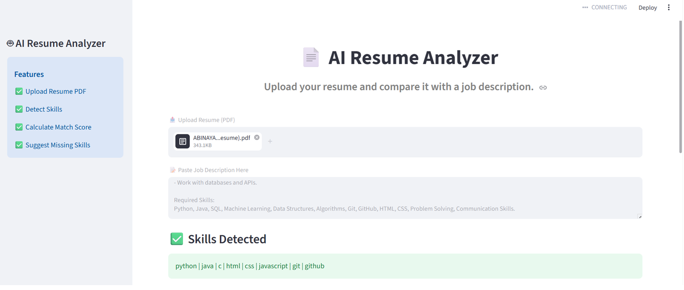
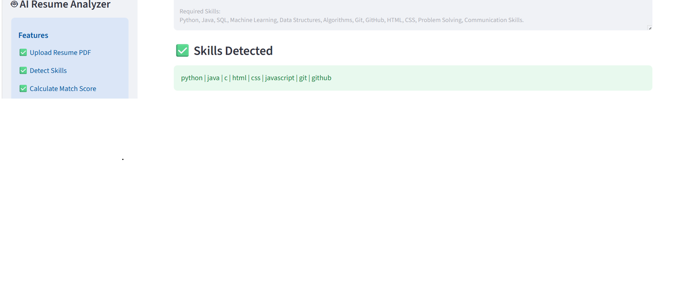
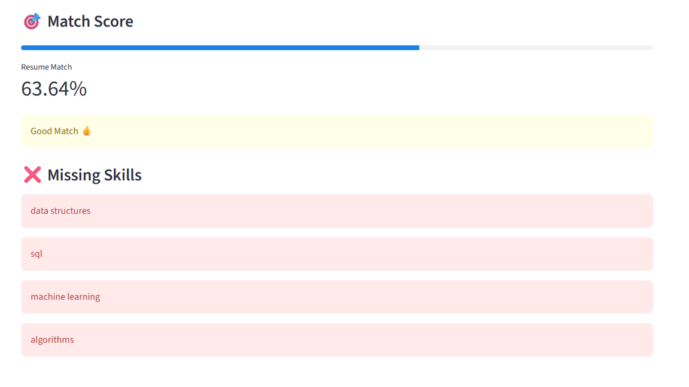

# 📄 AI Resume Analyzer

An AI-powered application that analyzes resumes and compares them with job descriptions.

## 🚀 Features
- Upload Resume PDF
- Extract Skills from Resume
- Compare Resume with Job Description
- Calculate Match Score
- Suggest Missing Skills

## 🛠️ Technologies Used
- Python
- Streamlit
- PyPDF2

## 📂 Project Structure
AI-Resume-Analyzer/
│
├── app.py
├── skills.py
├── requirements.txt
├── README.md
└── .gitignore

## ▶️ Run Locally

```bash
pip install -r requirements.txt
streamlit run app.py
```

## 📸 Screenshots

### Home Page


### Skills Detection


### Match Score & Missing Skills


## 👨‍💻 Author
Monesh V